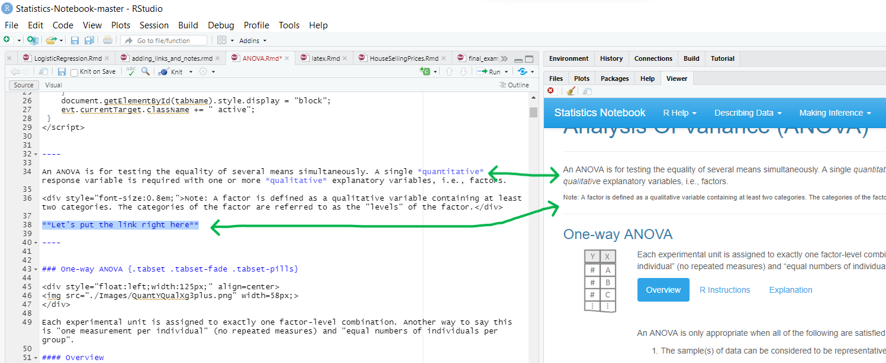

I like to save all of the code that I use for my Mobius and assessment quizzes so I have good examples to follow later when doing the analysis. I'm partial to .rmd files (at least for the Mobius Skills Quizzes) because I can easily organize different sections, add notes/explanations, and put in LaTeX equations. If you prefer R scripts, then just try to keep them organized in a new folder where you'll easily be able to find them again. But the **most important** thing is to just **save your code *somewhere* ** for future reference. If you do everything in the console, that code will be really difficult to get back after a few days.

# {.tabset .tabset-pills}


## How to make **effective** notes

### How do links work?

 **See the RMarkdown Hints portion of your notebook!**

To make a link use the code `[Name of Link](addressForLink)`. 

Linking to parts of your textbook:

* `[Numerical Summaries](NumericalSummaries.html)` *becomes* [Numerical Summaries](NumericalSummaries.html)
* `[Boxplots](GraphicalSummaries.html#boxplots)` *becomes* [Boxplots](GraphicalSummaries.html#boxplots)
* `[R Commands](RCommands.html)` *becomes* [R Commands](RCommands.html)

Linking to outside resources:

* `[R Colors](http://www.stat.columbia.edu/~tzheng/files/Rcolor.pdf)` *becomes* [R Colors](http://www.stat.columbia.edu/~tzheng/files/Rcolor.pdf)


### What is a good note, and what is a bad note? {.tabset}

#### A bad note:

$$
  \text{-start note-}
$$

Sneaky geom_bar()s

If you have a geom_bar() of counts, but you want proportions, try a position = "fill":


```r
geom_bar(position = fill)
```

Or, geom_bar with stat = "identity"

$$
  \text{-end note-}
$$


**What's bad about this? Why is it not effective?**

This note is incomplete in many ways! First of all, it doesn't do a very good job of explaining the *context* of its usefulness. In other words, when will this information be useful? Furthermore, this note doesn't even do a good job of explaining how to do the thing its talking about. I was clearly in a hurry when I wrote it, because the code wouldn't even run as is. Furthermore, it isn't complete enough for me to reproduce; if I wanted to actually do what it's talking about I'd still be lost. Worst of all, it gives 2 options (position = "fill" and stat = "identity") but never explains the difference or which is preferred!

**How might I make this note more effective?**

#### A good note:

$$
\text{-start note-}
$$

##### **Things to Group By**

One of ggplot's greatest features is the capacity to easily group data according to variables. This is most commonly used to assign different colors:

##### **Color and Fill**

In a GGPlot object, the plot type determines which variables apply to each plot. Perhaps the most critical are color and fill. Depending on the plot, some have color, some have fill, and some have both...but one of them is the color for the edge of the shapes. Look at the GGPlot Cheat Sheet(s) for help on which is which. Also note that if you want to manually *set* a specific color, you must specify the argument in the ggplot object or layer call but NOT inside the aes(), as this will attempt to use the color name given as a data frame variable to sort the data by. *The same is true for all aesthetics you wish to set manually.*


```r
Pottery_c <- Pottery %>% dplyr::filter(Site != "Caldicot") #removing Caldicot due to small sample
p <- ggplot(Pottery_c) + labs(title = "Chemical Composition of Ancient UK Pottery")
#
#geom_boxplot uses FILL
p + geom_boxplot(aes(Al, fill = Site), outlier.shape = NA)

#But geom_point (scatterplots) uses COLOR
p+ geom_point(aes(Al,Fe, color = Site))
```


```r
ggplot(GSS_clean, aes(spanks, fill = has_rel)) + #Create plot object with assigned fill
  geom_bar(position = "dodge") + #Add a Bar Plot to the object to visualize
  theme_solarized() + #Theme for quick change of overall aesthetic
  scale_fill_solarized() + #Colorize plot to match theme
  scale_x_discrete(labels = c("Strongly Oppose", "Oppose", #Change the item labels on the x axis
                              "Approve", "Strongly Approve")) + 
  labs(title = "Are Christians more likely to spank their children?",  #change title
       x = "Spanking Preference",  #change x axis title
       y ="Count") + #change y axis title
  guides(fill = guide_legend(title = "Religious Preference")) #change Legend Title
```

##### Other aesthetics to group by

Color/fill are fine, but also consider alpha, size, and shape, all spelled that way. If using geom_smooth, try linetype. Or, set a boolean with a true false statement in the aesthetic mapping. Lastly, if for insane reason you want to group variables but not change their aesthetics in any way (possibly useful maybe in geom_smooth()), use group = as the aesthetic argument.

See [R For Data Science, Chapter 3](https://r4ds.had.co.nz/data-visualisation.html#aesthetic-mappings) for more.

$$
 \text{-end note-}
$$

**What makes this note effective? What does it convey?**

This note takes something that I need to do frequently, assign colors in a ggplot, and explains the context and workings of the necessary code. It clarifies a common misconception by disambiguating the times we want to specify color in an `aes()` argument instead of directly in the geom_* object, and why.

Further, this note give **detailed** example code, which in its original location actually runs. The output and the code are visible to the interested reader! Finally, it expands on the topic and gives information about where I can turn for more help on the topic.

**What else could I add to improve the efficacy of this note?**

### When do I put something in my notes?

We should avoid the extra work of overcrowding, but also provide enough detail. How do we meet that balance? I follow this rule:

**When I'm not 100% sure I'm going to remember it, and there's a good chance I'll need it again, I put it in my notes!**


### How do I connect concepts in my notes?

I'm awful at organization, so I just put everything in one big long document with carefully named titles. The important part is that I create a searchable document that speaks to *me*. I'm not writing these notes for anyone else, so if I think I'll remember "*how to do that one stinky function that does the thing with the wide data*" better than "*how to use pivot_longer()*", I put the thing I'll remember as the title and then I know what to search later. Links are helpful to connect concepts together, but the most effective way to learn how topics relate is to learn more, write more, and do more statistics!

<!-- end Daniel's section -->


<!-- start Addie's section -->

## Add links to a different .rmd file
Once I have my Mobius rmd file saved and knitted into an html file, I can add a link to that html file in my statistics notebook.

<br/>

Let's walk through how I would add a new link for a html file of my ANOVA Mobius quiz.

For the purpose of having a more complicated file path example, I'm going to keep my `mobius_anova.Rmd` and `mobius_anova.html` file in the ANOVA folder, which is in the Analyses folder of the statistics notebook. So, if I'm starting in the *main directory* of Statistics-Notebook-master, I would need to go into the Analyses folder, then go into the ANOVA folder, and that's where I'll find my `mobius_anova.html` file. That file path my file path would look like this:

`"Analyses/ANOVA/mobius_anova.html"`


<br/>

### ANOVA.Rmd
Now that I know where the file is that I want to link to, let's look at where I'll be inserting the link, which is in the `ANOVA.Rmd` file


<br/>

You don't want to mess up any of the javascript code at the beginning, so be sure to move down to a place that just has normal text.



### Adding the Link
The syntax for adding a link to the notebook is this: `[words you want to show](link_or_filepath)`

Since `ANOVA.Rmd` is in the main directory of Statistics-Notebook-master, all we need to do to get to `mobius_anova.html` is open the Analyses folder, then open the ANOVA folder, and then we find the `mobius_anova.html` file. 

This will be the same file path that I made earlier, `"Analyses/ANOVA/mobius_anova.html"`

So, to make a link to mobius_anova.html, I just need to give it that file path.


<br/>


## Add another tab in the .rmd files under the "Making Inference" tab

As it shows in the notebook under R Help/R Markdown Hints, you can make tabs using `{.tabset}`. All of the tests under the "Making Inference" tab uses these tabsets to go through Overview, R Instructions, and Explanation. You can, of course, easily add your own comments and notes throughout the rmd file (which is also a good idea), but if you want to have them all in one spot, you can add another tab to these sections!


In this example, I'm going to add another tab to the t Test section to keep all of my notes about it organized in one spot.

<br/>

### Find the End of the \{.tabset}

<!--  -->

If you don't care about nice formatting and just want the information, then adding another tab is as simple as add the correct amount of '#' *after* the `</div>` and *before* the `----`


<br/>

If you do care about the nice formatting, then you can just add the same code that the other tabs have at the beginning and end. 
`<div style="padding-left:125px;">`
`</div>`


<br/>
<br/>

#

---

No matter how you choose to add your notes, be sure to knit the Rmd file afterwards to update the html file.

---


```{=html}
<div id='goTop'></div>
<script>$(function () {
          $('#goTop').goTop({"container":"","appear":200,"scrolltime":800,"src":"fas fa-chevron-up","width":45,"place":"right","color":"","fadein":500,"fadeout":500,"opacity":0.5,"marginX":2,"marginY":2,"zIndex":9});
         });</script>
```


<!-- end Addie's section -->
